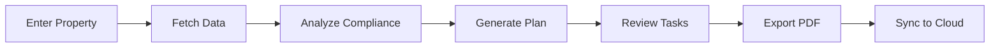

<div align="center">

# 🏠 AFH Renovator Pro

### *Transform Property Conversions from Weeks to Minutes*

[](LICENSE)
[](https://tauri.app/)
[](https://www.typescriptlang.org/)
[](https://reactjs.org/)
[](https://tauri.app/)
[](https://supabase.com/)

**Automated Adult Family Home renovation planning and DSHS licensing preparation for Washington state**

[Features](#-features) • [Quick Start](#-quick-start) • [Screenshots](#-screenshots) • [Installation](#-installation) • [Documentation](#-documentation)

---

</div>

<div align="center">


</div>

---

## 📑 Table of Contents

<details open>
<summary>Click to expand/collapse navigation</summary>

- [✨ Features](#-features)
- [🚀 Quick Start](#-quick-start)
- [📸 Screenshots](#-screenshots)
- [🛠️ Tech Stack](#️-tech-stack)
- [📦 Installation](#-installation)
- [💻 Usage](#-usage)
- [🔒 Security](#-security)
- [☁️ Cloud Sync](#️-cloud-sync)
- [📚 Documentation](#-documentation)
- [🤝 Contributing](#-contributing)
- [📄 License](#-license)

</details>

---

## ✨ Features

<div align="center">

### 🎯 Core Capabilities

</div>

<table>
<tr>
<td width="50%" valign="top">

### 🔍 **Property Analysis**
- **NWMLS Integration**: Direct access to Matrix database
- **Automatic Data Fetching**: MLS numbers or addresses
- **Comprehensive Parsing**: Square footage, rooms, dimensions, floor plans
- **Photo Extraction**: Property images for visual reference

</td>
<td width="50%" valign="top">

### 📊 **Compliance Checking**
- **DSHS Regulation Analysis**: WAC 388-76 series compliance
- **Real-time Issue Detection**: Critical, warning, and info flags
- **Rule References**: Direct links to regulations
- **Location-Specific**: Issues mapped to exact property areas

</td>
</tr>
<tr>
<td width="50%" valign="top">

### 🛠️ **Renovation Planning**
- **Customized Task Lists**: Property-specific recommendations
- **Cost Estimates**: Per-task and total project costs
- **Time Estimates**: Realistic completion timelines
- **Material Lists**: Required supplies for each task

</td>
<td width="50%" valign="top">

### 🎨 **Smart Prioritization**
- **Priority Sorting**: High → Medium → Low
- **DIY vs Professional**: Clear task classification
- **Permit Requirements**: Flagged automatically
- **Visual Placement**: Installation guidance

</td>
</tr>
<tr>
<td width="50%" valign="top">

### 💾 **Export & Sync**
- **PDF Generation**: Professional reports
- **Cloud Backup**: Optional Supabase sync
- **Multi-Device Access**: Access plans anywhere
- **Local Storage**: Offline-first architecture

</td>
<td width="50%" valign="top">

### 🔐 **Security First**
- **Keyring Storage**: System-level credential security
- **Local-First**: Data stays on your machine
- **Encrypted Sync**: Secure cloud backups
- **No Plain Text**: Credentials never exposed

</td>
</tr>
</table>

---

## 🚀 Quick Start

<div align="center">

### *Get up and running in 5 minutes*

</div>

### Prerequisites

```bash
# Check Node.js version (18+ required)
node --version

# Check Rust installation
rustc --version

# If Rust is not installed:
curl --proto '=https' --tlsv1.2 -sSf https://sh.rustup.rs | sh
```

### Installation Steps

<details>
<summary><b>📥 Step 1: Clone & Install</b></summary>

```bash
# Clone the repository
git clone https://github.com/yourusername/afhwabo_diy.git
cd afhwabo_diy

# Install dependencies
npm install

# Install Playwright browsers
npx playwright install chromium
```

</details>

<details>
<summary><b>⚙️ Step 2: Configuration (Optional)</b></summary>

```bash
# Copy environment template
cp .env.example .env.local

# Edit .env.local and add Supabase credentials (optional)
# NEXT_PUBLIC_SUPABASE_URL=your_url
# NEXT_PUBLIC_SUPABASE_ANON_KEY=your_key
```

</details>

<details>
<summary><b>🚀 Step 3: Run Development</b></summary>

```bash
# Start desktop app in development mode
npm run tauri:dev

# Or run Next.js web version
npm run dev
```

</details>

<details>
<summary><b>📦 Step 4: Build Production</b></summary>

```bash
# Build desktop app
npm run tauri:build

# Installers will be in: src-tauri/target/release/bundle/
```

</details>

---

## 📸 Screenshots

<div align="center">

### *See it in action*

<table>
<tr>
<td align="center" width="50%">

### 🏠 Property Input
*Enter MLS number or address to get started*


</td>
<td align="center" width="50%">

### 📊 Dashboard View
*Comprehensive renovation plan overview*


</td>
</tr>
<tr>
<td align="center" width="50%">

### ✅ Compliance Analysis
*Automated DSHS regulation checking*


</td>
<td align="center" width="50%">

### 📋 Task List
*Prioritized renovation tasks with details*


</td>
</tr>
</table>

> 💡 **Note**: Replace placeholder images with actual screenshots from your application

</div>

---

## 🛠️ Tech Stack

<div align="center">

### *Built with modern, production-ready technologies*

</div>

<table>
<tr>
<td align="center" width="33%">

### 🖥️ **Desktop Framework**
- **Tauri 2+** - Rust backend
- Native performance
- Small bundle size (~5-15 MB)
- Cross-platform

</td>
<td align="center" width="33%">

### ⚛️ **Frontend**
- **Next.js 15** - App Router
- **React 19** - Latest features
- **TypeScript** - Type safety
- **Tailwind CSS** - Styling
- **shadcn/ui** - Components

</td>
<td align="center" width="33%">

### 🔧 **Backend & Tools**
- **Playwright** - Web automation
- **pdf-lib** - PDF generation
- **Zustand** - State management
- **Supabase** - Cloud sync

</td>
</tr>
</table>

### 🎨 UI/UX Features

- ✨ **Dark/Light Mode** - Automatic theme switching
- 📱 **Responsive Design** - Works on all screen sizes
- ♿ **Accessible** - WCAG compliant
- 🎯 **Senior-Friendly** - Large text, high contrast
- 🚀 **Fast** - Optimized performance

---

## 📦 Installation

### System Requirements

| Platform | Requirements |
|----------|-------------|
| **Windows** | Windows 10+ (64-bit), Visual C++ Build Tools |
| **macOS** | macOS 10.15+, Xcode Command Line Tools |
| **Linux** | Ubuntu 20.04+ / Debian 11+ / Fedora 34+, WebKitGTK |

### Platform-Specific Setup

<details>
<summary><b>🍎 macOS</b></summary>

```bash
# Install Xcode Command Line Tools
xcode-select --install

# Install Rust
curl --proto '=https' --tlsv1.2 -sSf https://sh.rustup.rs | sh

# Install dependencies
npm install
npx playwright install chromium
```

</details>

<details>
<summary><b>🪟 Windows</b></summary>

```bash
# Install Rust
# Download from: https://rustup.rs/

# Install Visual C++ Build Tools
# Download from: https://visualstudio.microsoft.com/downloads/

# Install dependencies
npm install
npx playwright install chromium
```

</details>

<details>
<summary><b>🐧 Linux</b></summary>

```bash
# Install system dependencies (Ubuntu/Debian)
sudo apt-get update
sudo apt-get install -y \
    libwebkit2gtk-4.0-dev \
    build-essential \
    curl \
    wget \
    libssl-dev \
    libgtk-3-dev \
    libayatana-appindicator3-dev \
    librsvg2-dev

# Install Rust
curl --proto '=https' --tlsv1.2 -sSf https://sh.rustup.rs | sh

# Install dependencies
npm install
npx playwright install chromium
```

</details>

---

## 💻 Usage

### Basic Workflow



### Example: Generate a Plan

1. **Launch the app**
   ```bash
   npm run tauri:dev
   ```

2. **Enter property information**
   - Choose: MLS Number or Address
   - For testing: Enable "Use mock data"

3. **Generate plan**
   - Click "Generate Renovation Plan"
   - Wait 10-30 seconds for analysis

4. **Review results**
   - Check summary cards
   - Review compliance issues
   - Browse renovation tasks

5. **Export PDF**
   - Click "Export PDF" button
   - File saved to `Documents/AFH_Projects/`

### Advanced: Real NWMLS Data

1. **Enter credentials** (stored securely in keyring)
2. **Uncheck "Use mock data"**
3. **Enter MLS number or address**
4. **Generate plan with real property data**

---

## 🔒 Security

<div align="center">

### *Your data, your control*

</div>

<table>
<tr>
<td width="50%" valign="top">

### 🔐 **Credential Storage**
- ✅ System keyring (Keychain/Credential Manager)
- ✅ Never stored in plain text
- ✅ Encrypted at OS level
- ✅ Only accessible to app

</td>
<td width="50%" valign="top">

### 🛡️ **Data Protection**
- ✅ Local-first architecture
- ✅ No external servers (except NWMLS)
- ✅ Optional encrypted cloud sync
- ✅ Row Level Security (RLS) in Supabase

</td>
</tr>
</table>

### Security Best Practices

- 🔑 Credentials never committed to git
- 🔒 All sensitive data encrypted
- 🌐 Network requests only to trusted sources
- 👤 User data isolated with RLS policies

---

## ☁️ Cloud Sync

<div align="center">

### *Optional Supabase Integration*

</div>

### Features

- 📱 **Multi-Device Access** - Access plans from anywhere
- 💾 **Automatic Backup** - Never lose your work
- 🔄 **Real-time Sync** - Changes sync instantly
- 🔐 **Secure** - End-to-end encryption

### Setup

1. **Create Supabase project**
   - Visit [supabase.com](https://supabase.com)
   - Create new project

2. **Run database migration**
   ```sql
   -- Run supabase/migrations/001_initial_schema.sql
   -- in your Supabase SQL editor
   ```

3. **Configure environment**
   ```env
   NEXT_PUBLIC_SUPABASE_URL=your_project_url
   NEXT_PUBLIC_SUPABASE_ANON_KEY=your_anon_key
   ```

4. **Sign in to app**
   - Use Supabase authentication
   - Enable cloud sync in settings

---

## 📚 Documentation

<div align="center">

### *Comprehensive guides and references*

</div>

| Document | Description | Link |
|----------|-------------|------|
| 📖 **User Manual** | Complete feature guide | [docs/MANUAL.md](docs/MANUAL.md) |
| 🚀 **Quick Start** | 5-minute setup guide | [docs/QUICKSTART.md](docs/QUICKSTART.md) |
| 🎓 **Tutorial** | Step-by-step walkthrough | [docs/TUTORIAL.md](docs/TUTORIAL.md) |
| 🔧 **API Reference** | Technical documentation | [Coming Soon](#) |

### DSHS Compliance Rules

The application checks properties against **Washington State DSHS Adult Family Home regulations (WAC 388-76 series)**:

- 🛏️ **Bedrooms**: 80 sq ft minimum, egress windows, lockable doors
- 🚿 **Bathrooms**: 1 per 5 residents, grab bars, non-slip surfaces
- 🚨 **Safety**: Smoke detectors, fire extinguishers, temperature controls
- ♿ **Accessibility**: Door widths, ramps, handrails
- 🏗️ **Other**: Permits, pest control, emergency lighting

---

## 🤝 Contributing

<div align="center">

### *We welcome contributions!*

</div>

### How to Contribute

1. **Fork the repository**
2. **Create a feature branch**
   ```bash
   git checkout -b feature/amazing-feature
   ```
3. **Make your changes**
4. **Commit with clear messages**
   ```bash
   git commit -m "Add amazing feature"
   ```
5. **Push to your branch**
   ```bash
   git push origin feature/amazing-feature
   ```
6. **Open a Pull Request**

### Development Guidelines

- 📝 Follow TypeScript best practices
- 🧪 Write tests for new features
- 📚 Update documentation
- 🎨 Follow existing code style
- ✅ Ensure builds pass

---

## 📄 License

<div align="center">

### *Private - All rights reserved*

This project is proprietary software. Unauthorized use, distribution, or modification is prohibited.

</div>

---

## 🙏 Acknowledgments

<div align="center">

### *Built with amazing open-source tools*

</div>

<table>
<tr>
<td align="center" width="25%">

**[Tauri](https://tauri.app/)**  
*Desktop framework*

</td>
<td align="center" width="25%">

**[Next.js](https://nextjs.org/)**  
*React framework*

</td>
<td align="center" width="25%">

**[Supabase](https://supabase.com/)**  
*Backend platform*

</td>
<td align="center" width="25%">

**[shadcn/ui](https://ui.shadcn.com/)**  
*UI components*

</td>
</tr>
</table>

---

<div align="right">

### 🔗 [View on GitHub →](https://github.com/yourusername/afhwabo_diy)

*Last updated: 2026*

</div>

---

<div align="center">

**Made with ❤️ for Washington State Real Estate Professionals**

⭐ **Star this repo if you find it useful!**

</div>
